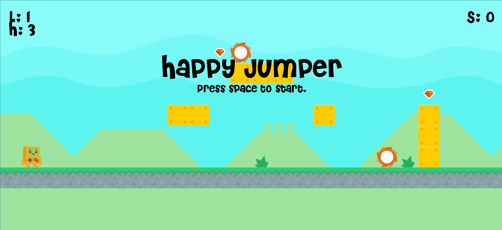
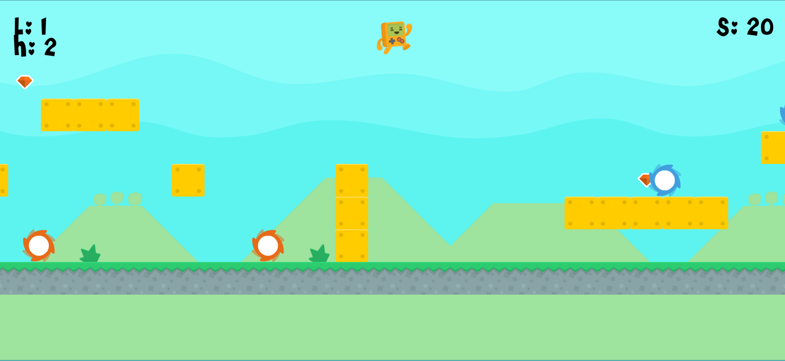
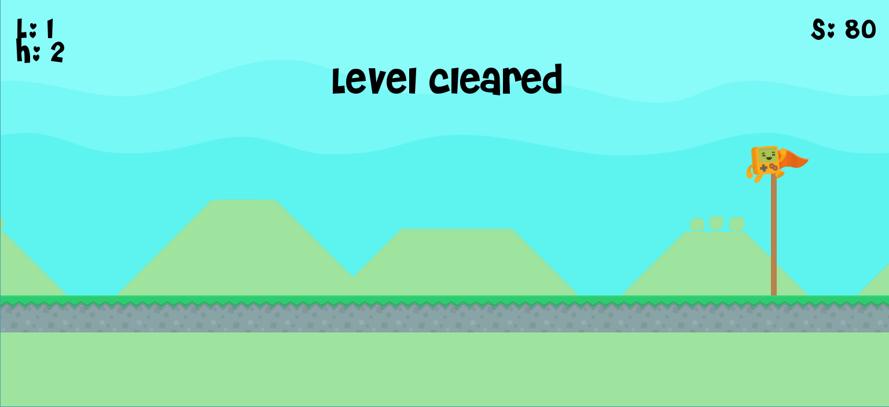
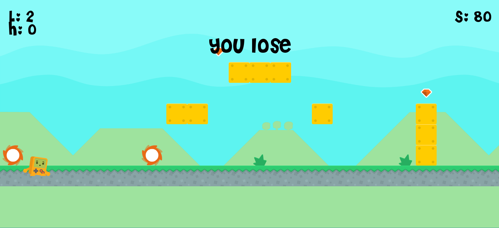
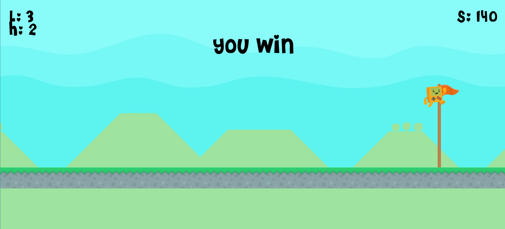

# Happy Jumper
Created by Evan Walker
[editor on GitHub](https://github.com/ewalke0309/Happy-Jumper/edit/master/README.md)

## Backstory

Timmy is a happy boy. He was always travelling, but one day he traveled to a countryside that had a lot of mean spinning boys. This made Timmy a sad boy. Timmy wants to get through the area without getting hurt. He is a very athletic boy and will use that to his advantage against the mean spinning boys.

## Objective

Get all of the gems and get to the flag without letting Timmy die.

## Instructions

-Press "Space" to start the game.
-Use the arrow keys to move left and right.
-Press "Space" to jump.
-Press "Space" after playing to play again.
-Each gem gives you 20 points.
-You have 3 hearts, once you lose them all you die.
-There are a few levels you will need to clear.

## Gameplay

### Start Screen

### Playing

### Level Clear

### Lose Screen

### Win Screen

## Releases
[Happy Jumper Version 0.4.0](https://github.com/ewalke0309/Happy_Jumper/releases)
